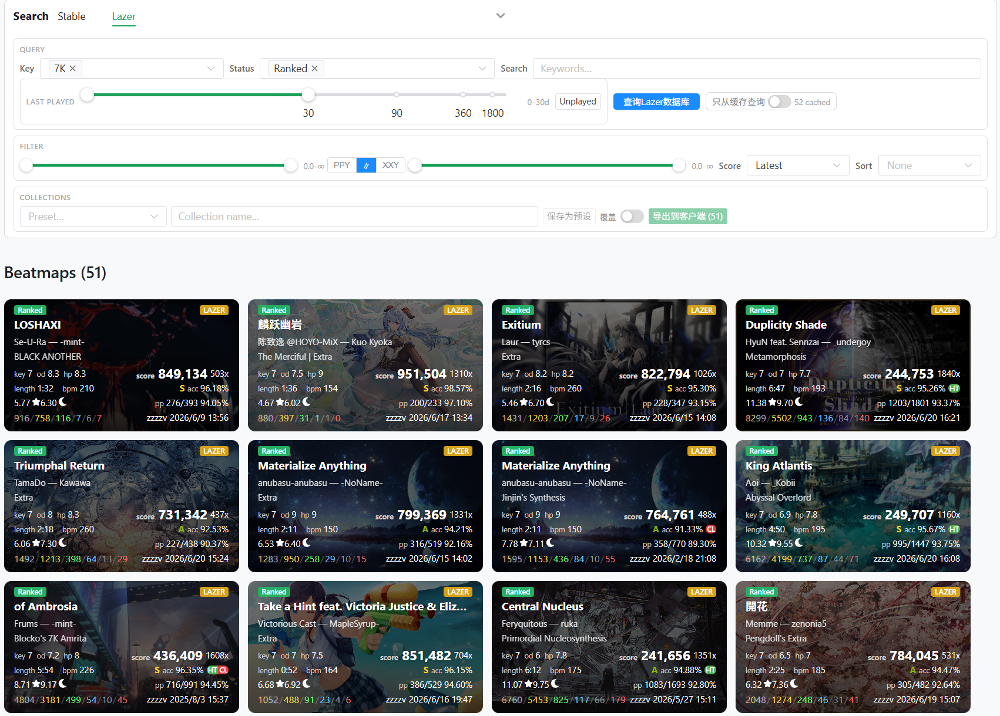

# Mania Lab

osu!mania 本地数据分析工具，支持stable和lazer。

- [x] 多条件搜索本地beatmap并显示成绩，支持xxy SR
- [x] 输出搜索结果到游戏收藏夹
- [ ] beatmap单图预览。使用[mania-svg](https://github.com/zzzzv/mania-svg)
- [ ] replay判定分析，支持用stable v1和lazer判定系统重新计算replay。使用[mania-judge](https://github.com/zzzzv/mania-judge)
- [ ] 在指定判定系统下的best PP表
- [ ] 可交互的beatmap和判定结果可视化面板

## 截图

## 后端依赖

- [OsuLocalServer](https://github.com/zzzzv/OsuLocalServer)
